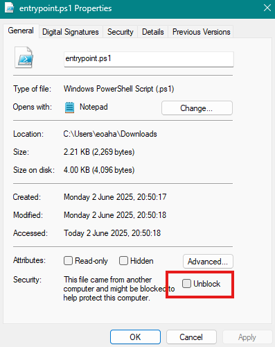

# Hyper-V Hosts File Manager

### Beta note:
 - sometimes this deletes the whole hosts file. I don't know why
 - if the hosts file is empty, this won't work

The scripts in this repo add the IPs of any running Hyper-V VMs to the hosts file on windows. They also enable forwarding between the WSL and Default Switch in Hyper-V, enabling SSH from WSL to a Hyper-V VM.

## Description

There are two big frustrations with using Hyper-V to run VMs on Windows. 
1. WSL does not communicate by default with VMs on the default switch on Hyper-V.
2. The IPs assigned to VMs by the Default Switch are not static and change at startup. 

Alternate switch configurations in Hyper-V can be configured to allow default communication with WSL, and static IP assignment. However, if you're not comfortable with Hyper-V networking, this can seem daunting, and can get very complicated very fast.

Updating the hosts file manually when using VMs is an option, but this is obviously cumbersome and can become frustrating. 

Running entrypoint.ps1 here will poll the Hyper-V VMs for their IP addresses, create a host entry, and add it to the hosts file (or update it if it already exists). The host entry will be in the form:
```
<vm_name> <vm_name>.local <vm_ipaddress>
```
If a Hyper-V is not displaying an IP address yet the script will retry for 60 seconds to retrieve one. This might happen if a VM has just been booted, or if Hyper-V can't get it's IP for some reason (I've noticed this with graphical VMs mostly).

## Usage

This script must be run in an admin Powershell terminal.

Ensure the config.json file is set up correctly. The variables`wslSwitch` and `defaultSwitch` must match the names of the corresponding switches in the Hyper-V Virtual Switch Manager.

- config.json example
```json 
{
  "hypervHostsCache": ".\\cache.json",
  "logsDir": ".\\logs",
  "wslSwitch": "vEthernet (WSL (Hyper-V firewall))",
  "defaultSwitch": "vEthernet (Default Switch)",
  "hosts_file_path": "C:\\Windows\\System32\\drivers\\etc\\hosts"
}
```
I suggest to place this in `C:\utils-and-scripts\windows\hyper-v-hosts\`

Run this script as admin with `C:\utils-and-scripts\windows\hyper-v-hosts\entrypoint.ps1`.

If you do not use WSL, you can disable the WSL switch check with `.\entrypoint.ps1 --no-wsl`.

## Scheduled task

Set this up as a scheduled task in Windows. To run as a scheduled task you must run `wscript.exe .\run_hidden.vbs` otherwise an annoying Powershell popup comes up every time. This also accepts to `--no-wsl` flag in the Arguments field.

In Task Scheduler:
 - Name: Check Hyper-V Hosts
 - Run whether user is logged in or not (optional)
 - Run with Highest Privileges (nescessary)


In Windows task scheduler Actions:
 - Program/script: wscript.exe
 - Add arguments: ".\\run_hidden.vbs"
 - Start in: "C:\utils-and-scripts\windows\hyper-v-hosts"

For the trigger: 
 - Begin the task: On an event
 - Log: Microsoft-Windows-Hyper-V-Hypervisor/Operational
 - Source: Hyper-V-Hypervisor


## WSL helper

Once it's set up as a Scheduled Task, you can run it directly from inside WSL with the following command:
```sh
schtasks.exe /run /tn "Check Hyper-V Hosts"'
```
Set up an alias in .bashrc to enable running this from WSL on demand, in case the scheduled task is flaky:
```sh
# ~/.bashrc

alias hyperv-hosts='schtasks.exe /run /tn "Check Hyper-V Hosts"'
```

## Notes

If you can't run the script, make sure execution policy in Powershell is correctly set, and the file is Unblocked (set in properties). 




The variable `new_vm_threshold` is disabled. Originally the idea of these scripts was to run a scheduled task every minute, but it makes more sense to have the scripts be triggered by Hyper-V actions.

This has a tendency to leave the hosts file a mess. I suggest using PowerToys Hosts File GUI to help keep track of things. This script was written to be compatible with this GUI https://github.com/microsoft/PowerToys

